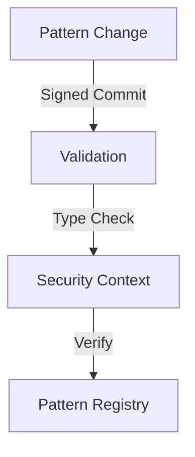
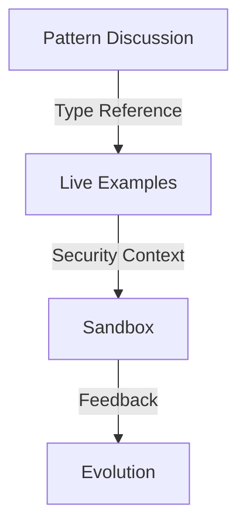
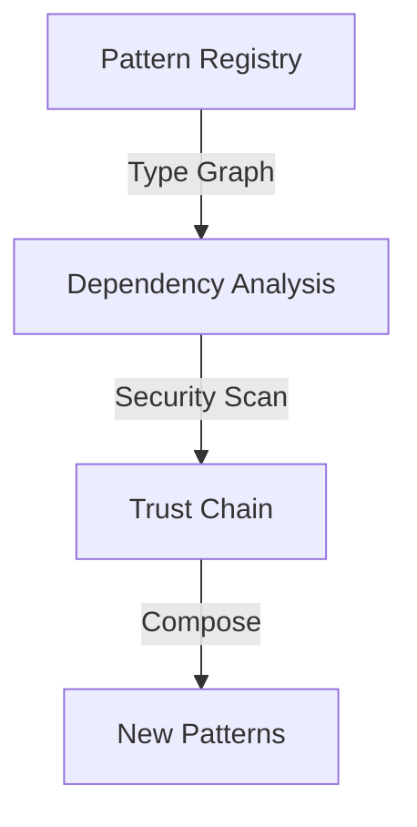

# GitHub + UPL: The Printing Press of the AI Era

## A New Renaissance 

Just as the printing press democratized knowledge in the Renaissance, the combination of GitHub and the Universal Pattern Language (UPL) will democratize digital agency in the AI era. But this is far more than just sharing code - it's about creating a living, breathing ecosystem for human intent and machine understanding.

## The Foundation: Why GitHub?

GitHub isn't just a code repository - it's already the world's largest platform for collaborative knowledge work. Its features form the perfect foundation for UPL:

### Digital Signatures & Trust

- **Commits**: Every pattern change is signed, timestamped, and traceable
- **GPG Signing**: Cryptographic proof of pattern authorship
- **Branch Protection**: Governance of pattern evolution
- **Code Owners**: Pattern stewardship and responsibility

### Pattern Evolution & Composition

- **Fork & Pull Model**: Patterns can evolve while maintaining provenance
- **Network Graph**: Visualize pattern evolution and relationships
- **Dependency Graph**: Track pattern compositions and dependencies
- **Package Registry**: Distribute verified pattern implementations
- **Actions**: Automated pattern validation and composition

### Collaborative Intelligence

- **Discussions**: Human discourse about pattern meaning
- **Issues**: Document pattern challenges and evolution
- **Wiki**: Capture pattern context and knowledge
- **Projects**: Coordinate pattern development
- **Copilot**: AI-assisted pattern creation
- **CodeQL**: Pattern analysis and validation

## The Universal Pattern Language Integration

When UPL becomes a native part of GitHub, every feature transforms:

### Commits & PRs

- Every commit includes type-safe pattern definitions
- PRs show pattern impact analysis
- Automated security context validation

### Discussions & Issues

- Discussions link directly to runnable patterns
- Issues include pattern impact analysis
- Security contexts preserve trust boundaries

### Network & Dependencies

- Network graph shows pattern evolution
- Dependencies track security contexts
- Automated composition validation

## Transformative Impact

### For AI Development

1. **Training Evolution**
- Patterns capture intent explicitly
- Reduced training costs through shared understanding
- Built-in governance and validation

2. **Model Behavior**
- Type-safe pattern constraints
- Traceable decision processes
- Composable safety measures

3. **Collaboration**
- Cross-org pattern sharing
- Security context preservation
- Trust boundary management

### For Digital Agency

1. **Personal Identity**
- Portable security contexts
- Verifiable pattern history
- Digital sovereignty

2. **Knowledge Sharing**
- Pattern-based learning
- Security-preserving collaboration
- Trust network building

3. **Innovation**
- Pattern composition markets
- Security-bounded experimentation
- Rapid evolution cycles

### For Society

1. **Governance**
- Transparent pattern evolution
- Traceable impact analysis
- Democratic participation

2. **Trust**
- Cryptographic verification
- Security context preservation
- Pattern provenance

3. **Progress**
- Reduced friction in innovation
- Preserved security boundaries
- Sustainable evolution

## The Path Forward

### Phase 1: Foundation
1. UPL GitHub Action for pattern validation
2. Pattern-aware PR checks
3. Security context verification

### Phase 2: Integration
1. Native pattern visualization
2. Security context propagation
3. Composition analysis tools

### Phase 3: Ecosystem
1. Pattern marketplace
2. Trust network formation
3. Cross-platform bridges

## Join the Evolution

The combination of GitHub and UPL isn't just a new tool - it's a fundamental transformation in how humans and machines collaborate. It provides:

- **For Individuals**: True digital agency and portable identity
- **For Organizations**: Secure pattern composition and evolution
- **For Society**: Transparent governance and trust networks

This is the printing press of the AI era - but instead of just sharing static knowledge, it enables the sharing of living, secure, composable patterns of intent.

The infrastructure exists. The need is clear. The time is now.

## Call to Action

1. Star this repository
2. Join the pattern discussions
3. Start evolving your patterns
4. Help build the future

## Technical Resources

- [UPL Specification](../spec/README.md)
- [Pattern Examples](../examples/README.md)
- [Security Model](../security/README.md)
- [Integration Guide](../integration/README.md)

## License

CC BY-SA 4.0

---

*"In the AI era, our patterns are our voice. GitHub + UPL is how we make them heard."*
